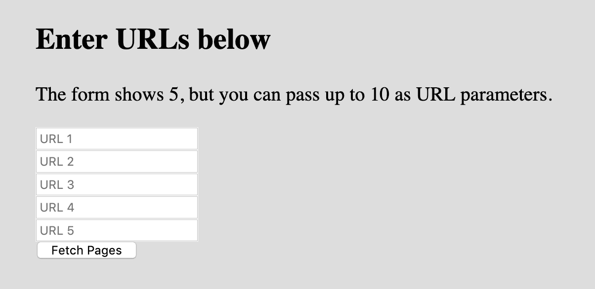
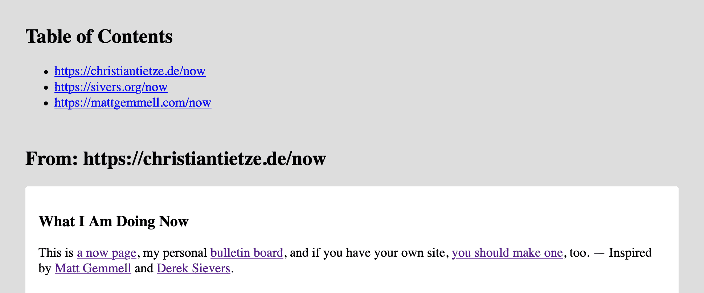

# /now Page Aggregator in PHP

A simple tool to fetch the contents of [/now pages](https://sivers.org/nowff) and display them all on a single page.

Test it online! **Thanks to [@crazko](https://github.com/crazko/) for setting this up:**

or visit https://hnow.herokuapp.com (may be outdated).

## Why!

/now pages are like personal bulletin boards. They are like Facebook status updates, but different. They reflect the overall current status of someone.

If you want to catch up with a pal, you don't have to browse through the last 2 months of their social media posts. Instead, you can see at a glance what they think is important in their lived on their /now page.

And this tool helps you stay up-to-date with all of them at once.

## How!

Use this tool to fetch /now pages of your friends and show them on a single summary page.

There's no need for an API. It's all on the web already, anyway, so just fetch the content and display the gist of it, without navigation, style, etc.

This tool requests the /now pages of your choice (up to 10) and then extracts the absolute minimum to display the content to you:

1. It limits the selection to the [`h-now` microformatted section](https://christiantietze.de/posts/2020/05/now-page-microformat/), if possible. That's what we want to slowly establish here: adoption of the `h-now` class in HTML.
2. If there's no HTML tag with the `h-now`class, the tool applies heuristics to figure out how to narrow down the full website to the bare content. That means it looks for `<main>` tags or the `#content` ID.

## Installation & Usage

Download the script and run it locally with PHP.

- Requires PHP 7.1+

This is how you download the code and access the PHP script in your browser:

    $ git clone https://github.com/ChristianTietze/NowPageAggregatorPHP
    $ cd NowPageAggregatorPHP/
    $ php -S localhost:3333
    PHP 7.4.6 Development Server (http://localhost:3333) started

The server is now running. Head to <http://localhost:3333/> to see a form where you can add your favorite /now page URLs.

When you submit the form, you will see the relevant portion of the /now pages in your personal summary: ([See full screenshot](assets/screenshot_full.png))

## License

Copyright &copy; 2020 Christian Tietze. Distributed under the MIT license. See [LICENSE](LICENSE) for details.

The page parsing is adopted from the [php-mf2](https://github.com/microformats/php-mf2/) microformats parser, CC-0 1.0 / Public Domain.
